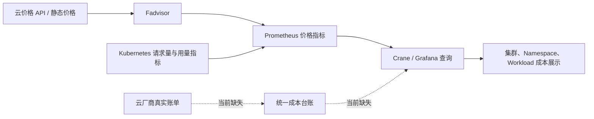

# Crane 国内多云成本与新版 Kubernetes 兼容性评估

> 评估日期：2026-07-17  
> 评估对象：当前工作区 `github.com/gocrane/crane`，提交 `2b0ddae`  
> 明确目标云：阿里云、火山引擎、华为云；用户原始描述中“阿里云”重复出现，本文将腾讯云作为 Crane/Fadvisor 已有实现基线及“等其他国内云”的首个扩展对象一并评估。  
> 新版 Kubernetes 目标：当前仍在维护的 1.34、1.35、1.36 三个次版本。

> **实施状态说明（2026-07-17）**：本文第 1-9 节记录提交 `2b0ddae` 的实施前基线。当前工作区已按本评估落地第一版代码，完整实现范围、配置方式、验证证据和仍需云账号/托管集群完成的验收项见 [多云成本与 Kubernetes 兼容性实现说明](multi-cloud-cost-and-kubernetes-implementation.zh.md)。请勿再把下文的“当前不支持”理解为本工作区实施后的状态。

## 1. 结论先行

当前项目适合继续作为 Kubernetes 资源分析、优化建议和成本展示的基础，但**不能直接宣称已经支持国内多云成本，也不能直接宣称支持当前新版 Kubernetes**。

| 评估项 | 当前结论 | 说明 |
| --- | --- | --- |
| Kubernetes CPU/内存成本估算 | 部分具备 | Crane 使用 Fadvisor 价格指标和 Prometheus 用量/请求量进行估算，主要覆盖节点 CPU、内存成本 |
| 腾讯云价格 | 有基础实现 | 外部 Fadvisor 当前有腾讯云适配，但实现和依赖均较旧，且主要是价格估算，不是完整账单平台 |
| 阿里云、火山引擎、华为云价格 | 不支持 | Fadvisor 源码没有对应 Provider 实现 |
| 多云真实账单 | 不支持 | 当前仓库没有统一账单采集、明细存储、分摊、摊销、退款/调账和对账链路 |
| 多集群成本 | 仅支持切换查看 | Dashboard 可登记多个 Crane/Grafana 地址，但没有统一的跨集群、多账号、多云成本台账和聚合查询 |
| Kubernetes 1.34-1.36 | 未支持、未验证 | 依赖基线为 Kubernetes 1.22，EHPA、CRI、cgroup、Kubelet 内部包和外部 Helm Chart 均存在明确升级项 |
| 新版集群“仅成本”模式 | 可优先改造 | 关闭 crane-agent、EHPA/QoS 等高耦合能力后，成本展示链路可较快形成新版 Kubernetes 兼容版 |

建议采用两条解耦的建设线：

1. **成本线**：保留实时估算，但新增独立的真实账单采集与成本归一化平台；不要把账单明细强行塞入 Prometheus。
2. **Kubernetes 线**：先交付新版集群的“成本只读模式”，再升级 Crane 的弹性、驱逐和节点资源增强功能。

最终目标不是给 Fadvisor 增加三个 `switch` 分支，而是把 Crane 从“单集群价格指标展示”升级为“多云费率 + 真实账单 + Kubernetes 分摊 + 对账”的统一成本平台。

## 2. 评估范围与方法

本次覆盖：

- 当前 Crane 仓库的依赖、控制器、Agent、部署清单和 Dashboard；
- 外部依赖 [gocrane/fadvisor](https://github.com/gocrane/fadvisor) 的 Provider 能力；
- 外部 [gocrane/helm-charts](https://github.com/gocrane/helm-charts) 的新版 Kubernetes API 风险；
- 阿里云、火山引擎、华为云、腾讯云官方账单 API 能力；
- Kubernetes 当前维护版本及废弃 API、CRI、cgroup v2 要求。

已执行本地验证：

```text
GOCACHE=/tmp/crane-go-build GOMODCACHE=/tmp/crane-go-mod go test ./...
```

测试通过，但应正确理解结果：它只证明当前代码能在锁定的 Kubernetes 1.22 Go 依赖上编译并通过现有单元测试；仓库没有 Kubernetes 1.34-1.36 的 Kind/E2E 矩阵，也没有在 ACK、VKE、CCE、TKE 托管集群上的验证证据。

本次未连接用户生产集群，也未使用任何云账号凭证调用账单 API。因此，云厂商字段映射、权限边界、限流和账单样本解析仍需在 PoC 阶段以真实脱敏样本验证。

## 3. 当前成本链路是什么

当前实现更接近“节点费率 × Kubernetes 资源量”的成本估算：



本仓库中的证据包括：

- README 把云价格与账单采集职责放在外部 Fadvisor，而不是 Crane 本体：`README.md:44-47`、`README.md:77-79`；
- Dashboard 使用 `node_total_hourly_cost`、`node_cpu_hourly_cost`、`node_ram_hourly_cost` 与 Kubernetes 请求量/用量计算成本：`pkg/web/values.yaml:236-318`；
- 月成本按“最近一小时单价 × 730 × 人工折扣”估算：`pkg/web/src/pages/Dashboard/Base/components/TopPanel.tsx:28-65`；
- UI 货币符号硬编码为人民币 `¥`：`pkg/web/src/pages/Dashboard/Base/components/TopPanel.tsx:14-16`；
- 多集群模型只保存 `CraneUrl`、`GrafanaUrl` 和一个整数折扣：`pkg/server/store/cluster.go:10-25`，没有云厂商、账号、币种、账期或成本口径字段。

因此，当前页面中的“总成本”应被定义为**估算成本**，不能直接作为财务账单、付款金额或月结对账结果。

## 4. 国内多云成本能力评估

### 4.1 Fadvisor 的实际扩展能力

Fadvisor 抽象了 Cloud Provider，方向上允许扩展，但当前实现存在以下边界：

- 官方 README 的云上部署说明只列出腾讯云和 qcloud 配置，[当前页面也明确说明云上实现为 Tencent Cloud](https://github.com/gocrane/fadvisor#deploy-on-cloud)；
- Provider 自动识别只覆盖 qcloud，其他情况回退到静态默认价格；
- 一个进程选择一个 Provider，不适合直接处理同一集群内的混合云/虚拟节点多 Provider 场景；
- 核心指标只有节点 CPU、内存和总小时费率，缺少账号、集群、币种、付费模式、服务、SKU 等统一维度；
- 当前实现未形成可验证的真实账单明细采集、持久化、摊销和对账能力；
- Fadvisor 的代码与 Kubernetes 依赖同样停留在较老基线。若要长期维护，建议由项目方 fork 并接管，或重写为独立 `cost-collector`，而不是继续把它当作无需维护的外部黑盒。

### 4.2 云厂商支持矩阵

| 云厂商 | 当前实现 | 官方账单能力 | 需要新增的核心适配 | 综合难度 |
| --- | --- | --- | --- | --- |
| 腾讯云 | Fadvisor 有 CVM 价格基础 | 有账单明细、资源汇总、成本分析及大账单文件/COS 路径 | 更新 SDK/鉴权；补真实账单；统一 TKE 节点与 CVM 实例映射；接入标准成本模型 | 中 |
| 阿里云 | 无 | BSS OpenAPI 提供账单总览、实例账单、成本分配和账单订阅到 OSS | ACK Node `providerID` 与 ECS 实例映射；DescribeInstanceBill/OSS 账单；包年包月摊销；企业财务账号；折扣退款 | 中 |
| 火山引擎 | 无 | 费用中心提供账单、分账账单和月/日/明细摊销成本 API | VKE 节点与 ECS 实例映射；账单/摊销 API；主子账号；项目和费用标签；API 限流与补采 | 中高 |
| 华为云 | 无 | BSS/OCE 提供资源消费记录、月度成本和 V4 成本分析接口 | CCE 节点与 ECS/BMS 实例映射；企业主子账号/企业项目；资源详单/成本 API；IAM 权限变化兼容 | 中高 |

官方接口可行性不是主要阻塞：

- 阿里云 BSS API 已提供实例账单和账单订阅到 OSS；当前的 `DescribeInstanceBill` 也明确存在账单延迟和月内调整语义，适合做异步账单采集，不适合作为实时价格查询。[阿里云 BSS API 概览](https://help.aliyun.com/en/user-center/developer-reference/api-overview-1)、[DescribeInstanceBill](https://help.aliyun.com/en/user-center/developer-reference/api-bssopenapi-2017-12-14-describeinstancebill)
- 火山引擎费用中心提供 `ListBillDetail`、`ListSplitBillDetail` 以及月、日、明细摊销成本接口。[火山引擎费用中心 OpenAPI](https://www.volcengine.com/docs/6269/1165275?lang=zh)、[ListBillDetail](https://api.volcengine.com/api-docs/view?action=ListBillDetail&serviceCode=billing&version=2022-01-01)
- 华为云提供资源消费记录、月度成本和 `POST /v4/costs/cost-analysed-bills/query` 成本查询。[华为云客户运营能力 API 参考](https://support.huaweicloud.com/api-oce/oce-api-pdf.pdf)
- 腾讯云提供 `DescribeBillDetail` 等账单接口；大规模账单应优先采用文件订阅/对象存储路径，避免依赖高频分页 API。[腾讯云账单明细 API](https://cloud.tencent.com/document/product/555/19182)

### 4.3 必须把“估算”和“实付”拆成两条数据平面

#### A. 实时估算平面

用途：分钟级看板、Namespace/Workload showback、优化前后成本估算。

输入：

- 云厂商公开/询价 API、合同价或自定义费率；
- Node、Pod、PVC、LoadBalancer、GPU 等 Kubernetes 资源关系；
- Prometheus 中的 request、usage、运行时长和闲置量。

输出：低基数、可聚合的 Prometheus 指标，例如：

```text
cloud_node_hourly_rate{
  provider="aliyun",
  account_id="...",
  cluster_id="...",
  region="cn-hangzhou",
  instance_type="ecs.g8i.xlarge",
  charge_model="payg",
  currency="CNY"
}
```

要避免把 `resource_id`、账单流水号等高基数字段全部放入 Prometheus 标签。

#### B. 真实账单平面

用途：财务实付、摊销、退款/调账、发票账期、跨账号和跨云对账。

推荐通过 API 增量采集与 OSS/COS/OBS/TOS 账单文件补采，写入 PostgreSQL/ClickHouse 等明细存储。归一化字段至少包括：

- `provider`、付款账号、资源归属账号、账期和发票/账单号；
- 云服务、SKU、区域、可用区、资源 ID、Kubernetes 集群 ID；
- 使用开始/结束时间、用量、单位、计费模式；
- 目录价、折前价、折后价、应付价、摊销成本、退款/调账；
- 原始币种、汇率日期、统一展示币种；
- 项目、成本中心、标签和原始扩展字段；
- 数据版本、首次采集时间、最后更新时间和幂等键。

真实账单会延迟、回补和变更，采集器必须支持：

- 至少回看最近 3-7 天并执行幂等覆盖；
- 月结后再做一次完整账期对账；
- API 限流、指数退避、断点续传和死信；
- 原始文件留存和可审计重放；
- 账单总额、归一化总额、已分摊总额三方平衡校验。

### 4.4 推荐的多云成本模块边界

不要继续使用一个“大而全”的 `Cloud` 接口强迫所有云厂商实现相同能力，建议拆成：

```go
type IdentityResolver interface {
    ResolveNode(ctx context.Context, node KubernetesNode) (CloudResourceIdentity, error)
}

type RateCardProvider interface {
    GetRates(ctx context.Context, query RateQuery) ([]Rate, error)
}

type BillSource interface {
    Pull(ctx context.Context, cursor BillCursor) (BillPage, error)
}

type BillFileSource interface {
    ListAndImport(ctx context.Context, period BillingPeriod) error
}
```

另外独立提供：

- `Normalizer`：厂商字段映射为统一成本模型；
- `Reconciler`：对齐云资源 ID、Node `providerID`、集群 ID 和账单资源 ID；
- `Allocator`：按 Namespace、Workload、Pod、标签、成本中心分摊，显式处理 idle/shared cost；
- `CostQueryService`：跨云、跨账号、跨集群查询；
- `CredentialProvider`：优先使用工作负载身份/STS，无法使用时才采用最小权限 Secret，并支持轮换。

### 4.5 第一阶段应覆盖哪些成本

按价值和实现确定性排序：

1. 节点计算：ECS/CVM、包年包月和按量、竞价/抢占式、GPU；
2. Kubernetes 托管控制面费用；
3. 云盘/PVC、快照；
4. LoadBalancer、EIP、公网带宽和 NAT；
5. Serverless/虚拟节点 Pod；
6. 与集群强相关的日志、监控、镜像仓库；
7. RDS、Redis、对象存储等非 Kubernetes 资产可后续纳入统一云成本，但不应伪装成 Pod 成本。

仅实现 CPU/内存节点估算，不能被验收为“支持该云全部成本”。

## 5. 新版 Kubernetes 兼容性评估

### 5.1 目标版本基线

截至评估日，Kubernetes 官方维护最近三个次版本：1.34、1.35、1.36；当前项目依赖是 1.22.3，而 1.22 已于 2022 年结束维护。[Kubernetes Release History](https://kubernetes.io/releases/)

本项目的关键依赖：

```text
Go directive                  1.17
k8s.io/api                    v0.22.3
k8s.io/apimachinery           v0.22.3
k8s.io/client-go              v0.22.3
k8s.io/cri-api                v0.22.3
k8s.io/kubernetes             v1.22.3
sigs.k8s.io/controller-runtime v0.10.2
github.com/google/cadvisor    v0.41.0
```

这不是简单把 `go.mod` 中版本号从 0.22 改到 0.36 的升级。项目直接依赖多处 Kubelet 内部包、CRI alpha API、老 HPA 类型和 cgroup 实现，需要逐项迁移并做运行时测试。

### 5.2 明确风险清单

| 优先级 | 位置 | 风险 | 影响范围 | 建议 |
| --- | --- | --- | --- | --- |
| P0 | EHPA 控制器及 `gocrane/api` | 代码创建 `autoscaling/v2beta2` HPA；该 API 从 Kubernetes 1.26 起不再提供 | EHPA/Autoscaling 在 1.34-1.36 无法正常工作 | 全量迁移到 `autoscaling/v2`，同步升级 API 仓库、CRD schema、deepcopy/client 和迁移测试 |
| P0 | crane-agent CRI 客户端 | 使用 `runtime/v1alpha2`；Kubernetes 1.26+ 运行时基线要求 CRI v1 | PodResource、CPUManager 等节点能力可能无法连接现代 containerd/CRI-O | 改为 CRI v1，升级连接、超时、重连和 runtime endpoint 发现逻辑 |
| P0 | 依赖与 CI | 全部 Kubernetes 模块锁在 1.22，且没有新版 Kind/E2E 矩阵 | 无法给出可信支持声明 | 将 Kubernetes 依赖统一到同一次版本，并在 1.34/1.35/1.36 持续测试 |
| P1 | crane-agent cgroup/cAdvisor | 默认 cgroup driver 仍为 `cgroupfs`，内嵌 cAdvisor 0.41，并直接操作节点 cgroup | cgroup v2 + systemd 节点行为不确定 | 默认改为 systemd/自动探测；升级 cAdvisor；分别验证 cgroup v2、containerd、不同 OS 镜像 |
| P1 | Kubelet 内部包 | 大量引用 `k8s.io/kubernetes/pkg/kubelet/...` | 每次 Kubernetes 升级都会受到非稳定内部 API 变动影响 | 用稳定模块/自有适配层替换；无法替换的代码隔离为带版本测试的 node adapter |
| P1 | Pod 驱逐 | 使用 `policy/v1beta1.Eviction` 和 `EvictV1beta1` | 当前仍是废弃路径，未来兼容性和维护性差 | 改为 `policy/v1` 和 `EvictV1`，验证 PDB/优雅退出行为 |
| P1 | 外部 Fadvisor Helm Chart | 可选 Ingress 使用 `networking.k8s.io/v1beta1`，可选 HPA 使用 `autoscaling/v2beta1` | 在 1.34-1.36 启用相应功能时渲染出已移除 API | 改为 `networking.k8s.io/v1`、`autoscaling/v2` 并增加 `kubeVersion` 约束和渲染测试 |
| P1 | 发布物一致性 | 本仓库部署清单仍引用 Crane v0.10.0 镜像，但代码/最新发布为 v0.11.0 | 测试对象与源码不一致，出现问题难以追溯 | 构建不可变镜像，清单、Chart、源码版本统一，并输出 SBOM |
| P1 | 安全基线 | 外部 Chart 存在过宽 RBAC、静态 webhook 证书等历史实现 | 新版托管集群安全策略/审计难通过 | 最小权限拆分；使用 cert-manager 或内部证书轮换；增加 Pod Security 与 NetworkPolicy |
| P2 | `deploy/manifests_1.13` | 目录保留大量 `apiextensions.k8s.io/v1beta1` CRD | 误用会在现代集群直接失败 | 从现代发行包排除并标记为历史清单 |

关键代码证据：

- EHPA 从 `pkg/controller/ehpa/hpa.go:8` 开始直接使用 `autoscaling/v2beta2`，并在 `:92-108` 创建该版本的 HPA；官方要求从 1.26 起迁移到 `autoscaling/v2`。[Kubernetes 废弃 API 迁移指南](https://kubernetes.io/docs/reference/using-api/deprecation-guide/#v1-26)
- `gocrane/api v0.11.0` 的 EHPA 和 Analytics 类型也嵌入 `v2beta2.MetricSpec`，所以必须联动升级 API 仓库，不能只改 Crane import。
- `pkg/resource/pod_resource_manger.go:16-39` 和 `pkg/ensurance/cm/cpumanager/cpu_manager.go` 使用 `runtime/v1alpha2`；Kubernetes 官方说明 1.26+ 运行时必须支持 CRI v1。[CRI API](https://kubernetes.io/docs/concepts/containers/cri/#the-api)
- `pkg/utils/pod.go:91-110` 仍使用 `policy/v1beta1` 驱逐；当前文档应使用 1.22 起可用的 `policy/v1`。[API-initiated Eviction](https://kubernetes.io/docs/concepts/scheduling-eviction/api-eviction/)
- Kubernetes 推荐 cgroup v2，并提示直接依赖 cgroup 文件系统的 Agent 和独立 cAdvisor 必须升级；项目当前 cAdvisor 0.41 低于官方页面建议的 0.43 基线。[cgroup v2](https://kubernetes.io/docs/concepts/architecture/cgroups/)

注意：`external.metrics.k8s.io/v1beta1` 是 Kubernetes 聚合层的外部指标 API，不应仅因为带有 `v1beta1` 就误判为已删除的内置 API。它需要做服务发现和 APIService 可用性测试，但不是本次静态扫描发现的同类硬阻塞。

### 5.3 功能级兼容性判断

| 功能组合 | 1.34-1.36 当前判断 | 主要原因 |
| --- | --- | --- |
| Dashboard 静态页面 | 可能运行，未验证 | 与 Kubernetes API 耦合相对低，但后端、镜像和部署安全基线仍需升级 |
| 成本只读：Prometheus + 新 Cost Collector + Dashboard | 最适合作为首个交付 | 可以关闭 Agent、EHPA、QoS、Metric Adapter 等高风险能力 |
| Craned 推荐/分析 | 有条件可迁移 | 依赖 client-go/controller-runtime 和 CRD，需要统一升级与 E2E |
| EHPA/预测弹性 | 当前不可支持 | 直接创建已移除的 `autoscaling/v2beta2` HPA |
| QoS 驱逐 | 未支持、需迁移 | 废弃 Eviction 类型、节点行为和 PDB 语义需回归 |
| crane-agent PodResource/CPUManager | 高风险 | CRI v1alpha2、Kubelet 内部包、cgroup v2、cadvisor 旧版本 |
| Fadvisor 原版 Chart | 不应直接用于新版集群 | 可选模板存在已移除 API，且组件本身版本陈旧 |

### 5.4 推荐的升级落点

1. 实施开始时选择一个统一 Kubernetes 模块次版本，优先对齐当前最新维护线；`api`、`apimachinery`、`client-go`、`apiserver`、`cri-api` 必须保持一致，禁止混搭。
2. 升级当前受支持的 Go 版本、controller-runtime、Prometheus Adapter、VPA 和 cAdvisor，并处理各组件的迁移说明。
3. 移除或隔离 `k8s.io/kubernetes` 内部包依赖，建立明确的 node adapter 层。
4. 所有发行清单只使用稳定 API；Chart 声明支持的 `kubeVersion`，并在 CI 中对每个开关组合执行 `helm template` 和 schema 校验。
5. 新版兼容策略采用 Kubernetes `N-2`：本次即 1.34、1.35、1.36。每次新 Kubernetes minor 发布后增加新版本并淘汰已 EOL 版本。

## 6. 推荐实施路线

### 阶段 0：定义产品口径与样本（1-2 周）

- 明确“成本”是目录价、折后价、应付价还是摊销价；
- 确定实时估算与财务实付两套口径；
- 获取四家云的脱敏账单、账号结构、ACK/VKE/CCE/TKE Node 样本；
- 定义统一成本 schema、资源映射键、币种和时区；
- 决定闲置成本、共享成本、控制面、存储和网络的分摊规则。

退出条件：同一账期样本能映射到统一字段，且财务、平台、业务三方确认口径。

### 阶段 1：新版 Kubernetes 成本只读版（3-5 周）

- 构建新版基础镜像和 Chart；
- 关闭 crane-agent、EHPA、QoS、预测弹性和非必需 Metric Adapter；
- 新 Cost Collector 输出兼容现有看板的价格指标；
- 在 Kind 1.34/1.35/1.36 和至少一个托管集群完成安装/升级/卸载测试；
- 修复 Chart 稳定 API、命名空间、证书、RBAC 和 Pod Security 问题。

退出条件：三版本安装成功，成本指标可查询，Dashboard 可展示，重启/升级不丢配置。

### 阶段 2：多云费率与估算（4-6 周，可与阶段 1 后半段并行）

- 重构现有腾讯云适配；
- 实现阿里云、火山引擎、华为云 `IdentityResolver` 和 `RateCardProvider`；
- 支持按量、包年包月摊时、竞价/抢占式和 GPU；
- 扩展集群/账号/云厂商/币种维度；
- 增加缓存、限流、降级和费率新鲜度指标。

退出条件：四家云的节点账面规格与费率样本匹配，误差有明确解释，Provider 失败不会中断其他云。

### 阶段 3：真实账单、对账与分摊（6-10 周）

- 四家云账单 API 和文件补采；
- 原始账单留存、统一成本模型、增量更新和月结重算；
- Node/PVC/LB 等云资源与 Kubernetes 对象映射；
- Namespace/Workload/标签/成本中心分摊；
- 多云、多账号、多集群统一查询和估算/实付差异分析。

退出条件：云厂商账单总额与平台归一化总额可对平，未映射和未分摊成本可追踪，月内回补不会产生重复数据。

### 阶段 4：完整 Crane 功能现代化（6-10 周，可独立排期）

- EHPA 全面迁移到 `autoscaling/v2`；
- CRI v1、cgroup v2、systemd、containerd/CRI-O 适配；
- 清理 Kubelet 内部包耦合；
- 恢复并验证推荐、预测、QoS、CPUManager 等功能；
- 在 ACK、VKE、CCE、TKE 各做至少一套受控验收。

粗略量级为 **30-50 人周**，三至四名熟悉 Go/Kubernetes/云账单的工程师并行时，首个可用的“新版 Kubernetes + 多云估算”版本约需 2-3 个月，包含真实账单、统一对账和完整 Crane 功能的版本约需 4-6 个月。该估算不含云账号审批等待、历史账单治理和大规模数据平台建设；阶段 0 的真实样本会显著影响后续估算。

## 7. 验收标准

### 7.1 多云成本

- 阿里云、火山引擎、华为云、腾讯云均有独立 Provider 契约测试；
- 账号凭证最小权限、可轮换，日志和指标中不泄露密钥；
- 费率指标带云厂商、账号、集群、区域、实例类型、付费模式和币种；
- 真实账单支持延迟回补、退款、调账、包年包月摊销和幂等重采；
- 云厂商月账单总额与归一化总额差异可解释，默认门槛建议不超过 0.1% 或 1 元中的较大者；
- 分摊结果满足：原始成本 = 已分摊成本 + 未分摊成本，且可下钻到原始账单行；
- 估算成本和实付成本在 UI/API 中明确区分，不混用“总成本”名称；
- 单个 Provider API 故障不会影响其他云或历史查询。

### 7.2 Kubernetes 1.34-1.36

- CI 对 1.34、1.35、1.36 执行 CRD/Chart 渲染、安装、升级和卸载；
- 不再生成 `autoscaling/v2beta2`、`autoscaling/v2beta1`、`networking.k8s.io/v1beta1` 等已移除内置 API；
- EHPA 能创建和更新 `autoscaling/v2` HPA；
- 驱逐使用 `policy/v1`，PDB 和优雅退出回归通过；
- Agent 使用 CRI v1，在 containerd 与 CRI-O 至少各验证一次；
- cgroup v2 + systemd 为主测试面，节点重启和运行时重启后可恢复；
- APIService、webhook 证书轮换、RBAC、Pod Security、NetworkPolicy 通过安全检查；
- ACK、VKE、CCE、TKE 至少各有一套冒烟结果和支持矩阵；
- 文档明确列出各功能开关的支持状态，而不是只给一个笼统的“Kubernetes 兼容”。

## 8. 立即建议

1. **不要基于当前代码对外承诺“支持阿里云/火山引擎/华为云成本”或“支持 Kubernetes 1.34-1.36”。**
2. 将 Fadvisor 作为需要接管的旧组件：先 fork、补 CI 和依赖升级，再决定保留还是拆成新的 Cost Collector。
3. 先发布“成本只读兼容档位”，关闭 EHPA、QoS 和 crane-agent，快速打通新版 Kubernetes 的价值链路。
4. 成本产品从第一天就区分“估算费率”和“真实账单”，避免后续因数据口径重做存储和 API。
5. Provider 顺序建议为：腾讯云基线重构 → 阿里云 → 火山引擎 → 华为云；但正式排期可按实际云消费规模调整。
6. 实施前先收集四家云各一个月的脱敏账单和集群节点清单。没有真实样本时只能完成接口级适配，无法完成成本准确性验收。

## 9. 本次评估的输出边界

本报告完成了代码静态审查、旧依赖下测试、上游实现和官方接口文档核对，并给出目标架构、版本风险、阶段计划和验收标准。以下工作属于后续 PoC/实施，不包含在本次评估中：

- 使用真实云账号调用四家云 API；
- 部署到实际 ACK/VKE/CCE/TKE 集群；
- 修改 Crane、Fadvisor 或 Helm Chart 以完成兼容；
- 对真实账单精度、吞吐量和财务口径作最终验收。

## 10. 实施后的状态快照

| 能力 | 当前工作区状态 | 仍需外部验收 |
| --- | --- | --- |
| 四云真实账单 API | 已实现阿里云、火山引擎、华为云、腾讯云独立适配器、统一模型、游标和契约测试 | 四家云脱敏真实账单与最小权限账号联调 |
| 费率/估算 | 已实现统一 RateCard 契约、自定义费率目录及兼容 Crane Dashboard 的节点费率指标 | 云厂商实时报价/合同价自动同步 |
| 台账与分摊 | 已实现精确十进制、幂等覆盖、断点续采、回看补采、跨云查询、映射和守恒分摊 | PostgreSQL/ClickHouse、大账单文件归档及财务对账门槛 |
| Kubernetes API | 主代码已迁移 `autoscaling/v2`、`policy/v1`、CRI v1，升级至 Kubernetes 1.35 客户端依赖基线 | 上游 `gocrane/api` 的 CRD 内嵌 v2beta2 类型仍需独立升级 |
| 新版安装 | 已提供无集群权限的成本只读清单和 Chart，并建立 1.34/1.35/1.36 Kind CI | ACK/VKE/CCE/TKE 实集群冒烟 |
| Agent 节点面 | cgroup driver 改为读取 kubelet 配置/自动探测，cAdvisor 升级 | cgroup v2、containerd、CRI-O 和节点重启实机回归 |

因此，当前工作区可以声明为“**四云账单接口级实现 + Kubernetes 1.34-1.36 成本只读兼容实现**”，但在真实云样本和托管集群结果补齐前，仍不能声明财务精度或所有 Crane 节点增强功能已生产验收。
