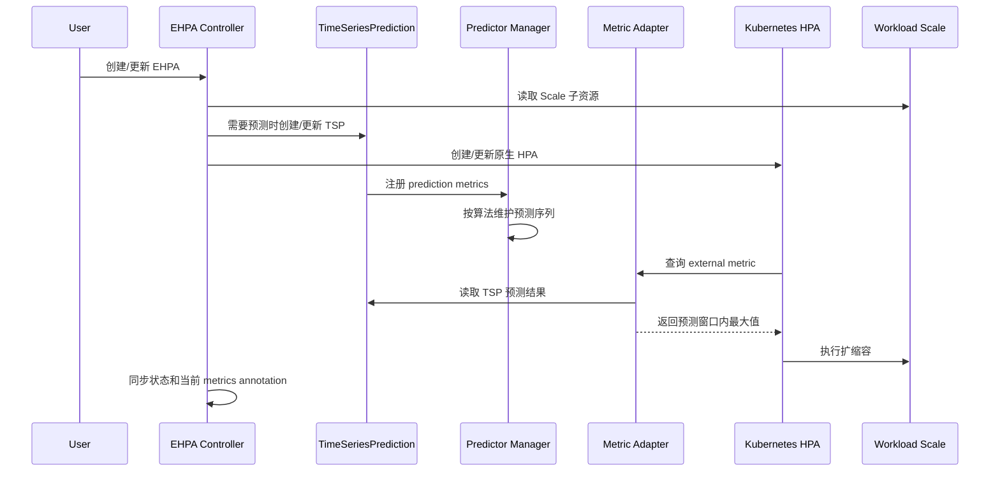
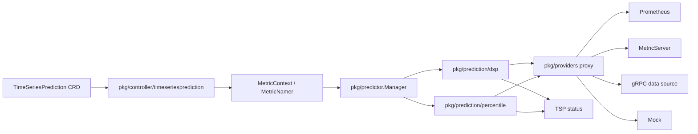
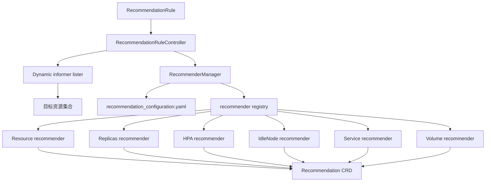
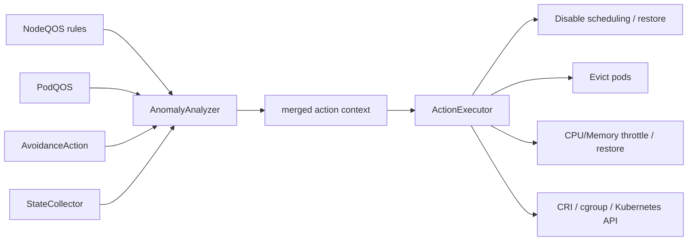

# Crane 项目实现与能力架构分析

本文面向希望快速理解 Crane 代码实现的研发读者，重点回答三个问题：

- Crane 由哪些运行进程组成，各自负责什么。
- 成本分析、推荐、预测弹性、QoS 保障等能力在代码里如何落地。
- 如果要扩展数据源、预测算法、推荐器或 Web API，应该从哪里入手。

分析范围基于当前仓库源码，重点阅读了 `README_zh.md`、`go.mod`、`cmd/` 下三个入口、`pkg/controller`、`pkg/predictor`、`pkg/prediction`、`pkg/providers`、`pkg/recommendation`、`pkg/ensurance`、`pkg/metricprovider`、`pkg/server`、`pkg/webhooks`、`deploy/manifests` 和 `pkg/web`。

## 一句话概览

Crane 是一个运行在 Kubernetes 上的 FinOps 和资源优化平台。它通过 CRD 表达优化意图，通过 `craned` 控制器把 CRD 转换为 Kubernetes 原生对象、预测任务和推荐结果，通过 `metric-adapter` 对接 HPA 的 Custom/External Metrics API，通过 `crane-agent` 在节点侧采集与执行 QoS 避让动作，并通过 Dashboard/Web API 提供可视化和操作入口。

技术栈上，后端是 Go 1.17 + Kubernetes controller-runtime + custom-metrics-apiserver + Gin；前端 Dashboard 在 `pkg/web`，使用 React 17、Vite、Redux Toolkit Query、TDesign、ECharts。

## 运行进程视图

| 进程/组件 | 部署方式 | 入口文件 | 核心职责 |
|---|---:|---|---|
| `craned` | Deployment | `cmd/craned/main.go`、`cmd/craned/app/manager.go` | 核心控制面：注册 CRD scheme、启动 controllers/webhooks/predictor/server、维护 Recommendation、EHPA、EVPA、TSP 等对象 |
| `metric-adapter` | Deployment + APIService | `cmd/metric-adapter/main.go` | 实现 Kubernetes Custom Metrics / External Metrics API，为 HPA 提供 cron/prediction/远程指标 |
| `crane-agent` | DaemonSet | `cmd/crane-agent/main.go`、`cmd/crane-agent/app/agent.go` | 节点侧数据采集、QoS 异常分析、避让执行、NodeResource/PodResource 汇报、可选 CPUManager |
| Dashboard | `craned` Pod 内独立容器或独立镜像 | `pkg/web/src/main.tsx` | 前端界面，调用 `craned` Web API、Prometheus/Grafana 代理和 Recommendation API |
| Fadvisor | 外部 Helm 组件 | 当前仓库无 `cmd/fadvisor` | 采集云资源价格/账单并写入 Prometheus，当前仓库主要通过文档和安装脚本引用 |
| CRD/部署清单 | Kubernetes manifests | `deploy/manifests/*.yaml`、`deploy/*` | 定义 Crane API 对象、RBAC、Service、Deployment、DaemonSet、Webhook、APIService |

## 总体架构图

```mermaid
flowchart TD
  User[User / Dashboard] --> WebAPI[craned Web API<br/>pkg/server]
  User --> K8sAPI[Kubernetes API]

  subgraph ControlPlane[craned 控制面]
    Manager[controller-runtime Manager<br/>cmd/craned/app/manager.go]
    Controllers[pkg/controller<br/>EHPA / EVPA / TSP / Recommendation / Analytics / CNP]
    PredictorMgr[pkg/predictor<br/>Predictor Manager]
    Predictors[pkg/prediction<br/>DSP / Percentile]
    Providers[pkg/providers<br/>Prometheus / MetricServer / gRPC / Mock]
    RecommenderMgr[pkg/recommendation<br/>Recommender Manager]
    Webhooks[pkg/webhooks<br/>Validating / Mutating]
    Metrics[pkg/metrics<br/>Prometheus collectors]
  end

  subgraph MetricsPlane[指标与预测供给]
    MetricAdapter[metric-adapter<br/>pkg/metricprovider]
    CustomMetrics[custom.metrics.k8s.io]
    ExternalMetrics[external.metrics.k8s.io]
    Prometheus[Prometheus]
    MetricServer[metrics-server]
    RemoteAdapter[Remote Adapter 可选]
  end

  subgraph NodePlane[节点侧 crane-agent]
    Agent[pkg/agent]
    Collector[pkg/ensurance/collector<br/>NodeLocal / cAdvisor / NodeResource]
    Analyzer[pkg/ensurance/analyzer]
    Executor[pkg/ensurance/executor<br/>schedule / evict / throttle]
    ResourceMgr[pkg/resource<br/>Node / Pod resource manager]
    Runtime[CRI / cgroup / kubelet]
  end

  subgraph CraneAPI[Crane CRDs]
    EHPA[EffectiveHorizontalPodAutoscaler]
    EVPA[EffectiveVerticalPodAutoscaler]
    TSP[TimeSeriesPrediction]
    RecommendationRule[RecommendationRule]
    Recommendation[Recommendation]
    Analytics[Analytics]
    NodeQOS[NodeQOS / PodQOS / AvoidanceAction]
    NRT[NodeResourceTopology]
  end

  Manager --> Controllers
  Manager --> PredictorMgr
  Manager --> Webhooks
  Manager --> Metrics
  Manager --> WebAPI
  Controllers --> EHPA
  Controllers --> EVPA
  Controllers --> TSP
  Controllers --> RecommendationRule
  Controllers --> Recommendation
  Controllers --> Analytics
  Controllers --> NRT
  Controllers --> RecommenderMgr
  Controllers --> PredictorMgr
  PredictorMgr --> Predictors
  Predictors --> Providers
  Providers --> Prometheus
  Providers --> MetricServer
  Providers --> RemoteAdapter
  MetricAdapter --> CustomMetrics
  MetricAdapter --> ExternalMetrics
  MetricAdapter --> TSP
  MetricAdapter --> EHPA
  MetricAdapter --> RemoteAdapter
  Agent --> Collector
  Collector --> Analyzer
  Analyzer --> Executor
  Executor --> Runtime
  Agent --> ResourceMgr
  Agent --> NodeQOS
  Agent --> NRT
  ResourceMgr --> TSP
  WebAPI --> Recommendation
  WebAPI --> RecommendationRule
  WebAPI --> Prometheus
  K8sAPI --> CraneAPI
```



## 代码目录导读

| 路径 | 责任 |
|---|---|
| `cmd/craned` | `craned` 进程入口和组合根，集中创建 manager、数据源、预测器、controller、webhook、Web API |
| `cmd/metric-adapter` | 自定义指标 API server 入口，注册 custom/external metrics provider |
| `cmd/crane-agent` | 节点代理入口，创建 informer、agent 和节点侧 managers |
| `pkg/controller` | 控制器实现，按能力拆分为 `ehpa`、`evpa`、`timeseriesprediction`、`recommendation`、`analytics`、`cnp` |
| `pkg/predictor` | 预测器管理器，按算法创建和启动预测器，绑定实时/历史数据代理 |
| `pkg/prediction` | 预测算法抽象与实现，包含 `dsp` 周期信号预测和 `percentile` 百分位预测 |
| `pkg/providers` | 指标数据源抽象与 Prometheus、MetricServer、gRPC、Mock 实现 |
| `pkg/querybuilder`、`pkg/querybuilder-providers` | 按数据源生成查询表达式，Prometheus 实现会生成 PromQL |
| `pkg/metricprovider` | `metric-adapter` 使用的 custom/external metrics provider，处理 cron、prediction 和 remote adapter |
| `pkg/recommendation` | 新推荐框架：manager、framework、recommender 插件和配置加载 |
| `pkg/recommend` | 较早的推荐实现/工具，包含 inspector 和 advisor，在部分 analytics 代码中仍可见 |
| `pkg/ensurance` | QoS 保障：节点采集、异常分析、避让执行、CPUManager、runtime/cgroup 交互 |
| `pkg/resource` | 节点和 Pod 资源管理器，用 agent 采集结果更新资源视图/建议 |
| `pkg/server` | `craned` Web API，使用 Gin 提供 cluster、recommendation、prometheus、dashboard、prediction debug 等接口 |
| `pkg/web` | React Dashboard 前端 |
| `pkg/webhooks` | CRD 校验 webhook 和 Pod QoS mutating webhook |
| `pkg/metrics` | Crane 自身 Prometheus 指标 |
| `pkg/known`、`pkg/features` | 常量、label/annotation、命名空间、feature gates |
| `deploy` | 部署清单、CRD、RBAC、Service、Webhook、APIService |
| `docs`、`site` | 文档站点内容与构建资源 |

## 启动流程

### craned

`cmd/craned/main.go` 只做日志初始化、信号处理和 Cobra 命令启动，主要逻辑在 `cmd/craned/app/manager.go`。

`Run` 的核心流程：

1. 从集群环境读取 REST config，设置 QPS/Burst。
2. 创建 `controller-runtime` manager，启用 leader election、metrics、healthz/readyz。
3. 根据 `--datasource` 初始化数据源：Prometheus、MetricServer、gRPC、Mock。
4. 创建 `predictor.Manager`，默认包含 DSP 和 Percentile 两类预测器。
5. 注册 API scheme、Pod `spec.nodeName` field indexer、webhooks。
6. 创建 `PodOOMRecorder`，用于记录 Pod OOM 信息并供 EVPA/Recommendation 使用。
7. 按 feature gate 注册 controllers。
8. 注册 Crane 自定义 Prometheus collector。
9. 并发启动 predictor manager、controller manager、Gin Web API。

默认开启的能力来自 `pkg/features/features.go`：

| Feature Gate | 默认值 | 说明 |
|---|---:|---|
| `Autoscaling` | true | EHPA、EVPA、Substitute、HPA observer |
| `Analysis` | true | Analytics、Recommendation、RecommendationRule |
| `NodeResource` | true | 节点资源能力 |
| `PodResource` | true | Pod 资源能力 |
| `TimeSeriesPrediction` | true | TSP 控制器和预测 |
| `ClusterNodePrediction` | false | 集群节点预测控制器 |
| `NodeResourceTopology` | false | 节点资源拓扑 |
| `CraneCPUManager` | false | 增强 CPU 管理 |
| `QOSInitializer` | false | Pod QoS mutating webhook |
| `DashboardControl` | false | Dashboard 控制能力 |

### metric-adapter

`cmd/metric-adapter/main.go` 使用 `sigs.k8s.io/custom-metrics-apiserver` 启动聚合 API server：

1. 注册 Kubernetes、Crane Autoscaling、Prediction API scheme。
2. 可选创建 `RemoteAdapter`，转发自定义或外部指标请求。
3. 创建 controller-runtime client、kube client、RESTMapper、Scale client、Event recorder。
4. 注册 `CustomMetricProvider` 和 `ExternalMetricProvider`。
5. 启动 custom/external metrics API。

本地 custom metrics 当前主要依赖 remote adapter；本地 external metrics 支持：

- `crane_autoscaling_cron`：根据 EHPA cron 配置返回目标副本数。
- `crane_autoscaling_prediction`：读取 TSP 中预测序列，在预测窗口内取最大值返回给 HPA。

### crane-agent

`cmd/crane-agent/app/agent.go` 会创建按节点过滤的 Pod/Node informer，以及 Crane CRD informer：

- `NodeQOS`
- `PodQOS`
- `AvoidanceAction`
- `TimeSeriesPrediction`
- `NodeResourceTopology`

随后 `pkg/agent/agent.go` 组装节点侧 managers：

1. 建立 CRI runtime 连接和 cAdvisor manager。
2. 可选创建/更新 `NodeResourceTopology`。
3. 可选启动增强 CPUManager。
4. 启动 `StateCollector` 采集节点、Pod、cAdvisor、NodeResource 等指标。
5. 启动 `AnomalyAnalyzer` 按 NodeQOS 规则判断是否触发避让。
6. 启动 `ActionExecutor` 执行调度禁用、驱逐、限流等动作。
7. 默认 NodeResource 打开时，创建节点级 TSP，并启动 `NodeResourceManager`。
8. 默认 PodResource 打开时，启动 `PodResourceManager`。
9. 暴露 `/metrics` 和 `/health-check`，可选 pprof。

## 能力地图

| 能力 | 用户/API 对象 | 主要实现 | 关键输入 | 输出/动作 |
|---|---|---|---|---|
| 成本展示与 Dashboard | Web API、Prometheus/Grafana | `pkg/server`、`pkg/web` | Prometheus 查询、cluster 配置、Grafana 配置 | Dashboard 面板、成本/推荐展示 |
| 资源推荐 | `RecommendationRule`、`Recommendation`、`Analytics` | `pkg/controller/recommendation`、`pkg/recommendation` | 资源选择器、Prometheus 历史数据、OOM 记录、预测器 | Recommendation CRD、可采纳 patch/状态 |
| 时间序列预测 | `TimeSeriesPrediction` | `pkg/controller/timeseriesprediction`、`pkg/predictor`、`pkg/prediction` | MetricNamer、Prometheus/MetricServer/gRPC 数据 | TSP status 中的预测结果 |
| 预测水平弹性 | `EffectiveHorizontalPodAutoscaler` | `pkg/controller/ehpa`、`pkg/metricprovider` | 目标 workload、cron、prediction、HPA metrics | HPA、Substitute、TSP、scale 动作 |
| 有效垂直弹性/资源建议 | `EffectiveVerticalPodAutoscaler` | `pkg/controller/evpa`、`pkg/autoscaling/estimator` | Pod template、OOM、Percentile predictor | EVPA status 资源推荐、Prometheus 指标 |
| HPA 指标供给 | Custom/External Metrics API | `cmd/metric-adapter`、`pkg/metricprovider` | EHPA/TSP/RemoteAdapter | HPA 可消费的 external/custom metrics |
| QoS 保障/混部避让 | `NodeQOS`、`PodQOS`、`AvoidanceAction` | `pkg/agent`、`pkg/ensurance` | 节点本地指标、QoS 规则、Pod/Node informer | 禁调度、驱逐、CPU/内存限流、恢复 |
| 节点资源拓扑 | `NodeResourceTopology` | `pkg/agent`、`pkg/ensurance/collector/noderesourcetopology` | `/sys`、kubelet config、Node 信息 | NRT CRD 更新 |
| 节点/Pod 资源上报 | TSP、node/pod metrics | `pkg/resource`、`pkg/ensurance/collector` | agent 采集状态 | 资源建议/预测相关数据 |
| 准入校验与初始化 | Webhook | `pkg/webhooks` | CRD 创建/更新、Pod 创建 | validation 或 Pod QoS 默认注入 |

## 核心链路

### 1. 预测驱动 EHPA

链路入口是 `EffectiveHorizontalPodAutoscaler` CRD，对应控制器在 `pkg/controller/ehpa/effective_hpa_controller.go`。



关键实现点：

- EHPA 控制器 watch `EffectiveHorizontalPodAutoscaler`，并 owns 原生 `HorizontalPodAutoscaler` 和 `TimeSeriesPrediction`。
- `ReconcilePredication` 位于 `pkg/controller/ehpa/predict.go`，会为 EHPA 生成带标准 label 的 TSP。
- `pkg/metricprovider/external_metric_provider.go` 通过 label selector 找到由 EHPA 管理的 TSP，并取预测窗口内的最大预测值返回。
- cron 弹性同样走 external metric，但 metric-adapter 直接根据 EHPA `Spec.Crons` 计算目标副本数。
- preview 策略会使用 `Substitute`，相关逻辑在 `pkg/controller/ehpa/substitute.go` 和 `substitute_controller.go`。

### 2. TimeSeriesPrediction 与预测器

`TimeSeriesPrediction` 控制器在 `pkg/controller/timeseriesprediction/time_series_prediction_controller.go`，它本身不实现算法，而是把 CRD 中的 `PredictionMetrics` 同步到 `predictor.Manager`。



预测抽象定义在 `pkg/prediction/interface.go`：

- `WithQuery` / `DeleteQuery`：注册或删除要预测的指标。
- `QueryPredictionStatus`：查询模型是否 ready。
- `QueryRealtimePredictedValues`：获取实时预测结果。
- `QueryPredictedTimeSeries`：获取指定窗口的预测序列。
- `QueryRealtimePredictedValuesOnce`：用于一次性分析任务。

当前 manager 默认创建两类预测器：

- `DSP`：`pkg/prediction/dsp`，偏周期信号预测，会从历史数据中寻找日/周周期并维护 aggregate signals。
- `Percentile`：`pkg/prediction/percentile`，基于历史或实时数据构造百分位估计，EVPA 和推荐中使用较多。

数据源抽象在 `pkg/providers/interfaces.go`：

- `RealTime`：`QueryLatestTimeSeries`
- `History`：`QueryTimeSeries`
- `Interface`：同时具备实时和历史能力

`RealTimeDataProxy` 和 `HistoryDataProxy` 会遍历已注册 provider，直到某个 provider 查询成功。当前选择策略是固定遍历，尚不是显式可配置策略。

### 3. RecommendationRule 到 Recommendation

推荐框架由 `pkg/controller/recommendation` 负责触发，由 `pkg/recommendation` 负责执行插件化流程。



执行流程：

1. `RecommendationRuleController` 根据 `ResourceSelectors` 查找目标资源，支持命名空间选择、Kind/APIVersion、name、label selector。
2. 每个目标资源和每个 recommender 组合成一个 `ObjectIdentity`。
3. 控制器创建或复用对应的 `Recommendation` 对象。
4. 通过 `RecommenderManager.GetRecommenderWithRule` 创建具体 recommender。
5. 构建 `framework.RecommendationContext`，注入 Kubernetes client、Scale client、OOM recorder、Predictor manager、历史数据源。
6. 按固定阶段执行 recommender。
7. 更新或创建 `Recommendation`，写入 run number、message、last start time、推荐结果。

推荐器接口在 `pkg/recommendation/recommender/interfaces.go`，由多个阶段组成：

```text
Filter
CheckDataProviders
CollectData
PostProcessing
PreRecommend
Recommend
Policy
Observe
```

内置 recommender 通过空白 import 注册在 `pkg/recommendation/manager.go`：

- `hpa`
- `idlenode`
- `replicas`
- `resource`
- `service`
- `volume`

`Analytics` 目前更像兼容/入口对象：`pkg/controller/analytics/analytics_controller.go` 中会把 Analytics 转换为 RecommendationRule。代码中仍能看到一些旧推荐实现注释和 `pkg/recommend` 旧框架，这一点是理解推荐模块时需要注意的历史包袱。

### 4. EVPA 与资源估算

`EffectiveVerticalPodAutoscaler` 控制器位于 `pkg/controller/evpa/effective_vpa_controller.go`。

核心流程：

1. 读取 EVPA CRD。
2. 默认化和校验 ResourceEstimators。
3. 读取目标 workload 的 PodTemplate。
4. 通过 `estimator.NewResourceEstimatorManager` 获取各容器资源估算器。
5. 调用 `ReconcileContainerPolicies` 计算推荐资源。
6. 更新 EVPA status，并记录 CPU/Memory scale up/down Prometheus 指标。

EVPA 当前不直接 patch workload，而是把推荐结果写入 EVPA status 和指标。它依赖：

- `pkg/autoscaling/estimator`：估算器管理和具体估算逻辑。
- `pkg/prediction`：Percentile predictor。
- `pkg/oom`：Pod OOM 记录。
- `pkg/utils/target`：目标资源选择和 scale/pod 关联。

### 5. QoS 保障与节点侧执行

QoS 能力主要在 `crane-agent` 内运行。核心链路是：



关键实现：

- `pkg/ensurance/collector/collector.go`：`StateCollector` 周期更新 collectors，并并发收集指标。
- `pkg/ensurance/analyzer/analyzer.go`：`AnomalyAnalyzer` 等待 informer cache 同步后，按 NodeQOS 匹配当前节点，读取规则并用 evaluator 判断触发/恢复。
- `pkg/ensurance/executor/executor.go`：`ActionExecutor` 从 channel 接收 `AvoidanceExecutor`，依次执行 schedule、evict、throttle 的 avoid 和 restore。
- `pkg/ensurance/executor/*`：各执行器细节，包括驱逐、调度禁用、CPU/内存限流、水位线、排序等。
- `pkg/ensurance/runtime`、`pkg/ensurance/grpc`：封装 CRI/runtime 连接。

这个设计是节点本地闭环：采集、分析、执行都在 agent 内存和 channel 中完成，CRD 提供规则和动作声明，Kubernetes API/CRI/cgroup 承担最终执行。

### 6. Web API 与 Dashboard

`craned` 内置 Gin server，入口为 `pkg/server/server.go`，路由在 `pkg/server/router.go`。

主要 API：

| 路由 | Handler | 用途 |
|---|---|---|
| `/api/healthz` | generic | 健康检查 |
| `/api/version` | generic | 版本信息 |
| `/api/klog` | generic | 动态调整 klog level |
| `/api/v1/cluster` | `handler/clusters` | 管理 Dashboard 中的 cluster 配置 |
| `/api/v1/namespaces/:clusterid` | `handler/clusters` | 查询命名空间 |
| `/api/v1/recommendation` | `handler/recommendation` | 推荐列表 |
| `/api/v1/recommendation/adopt/:namespace/:recommendationName` | `handler/recommendation` | 采纳推荐 |
| `/api/v1/recommendationRule` | `handler/recommendation` | 推荐规则 CRUD |
| `/api/v1/prometheus/query` | `handler/prometheus` | Prometheus instant query |
| `/api/v1/prometheus/query_range` | `handler/prometheus` | Prometheus range query |
| `/api/prediction/debug/:namespace/:tsp` | `handler/prediction` | TSP 预测调试视图 |

前端 `pkg/web/src/services` 使用 Redux Toolkit Query 对应这些 API：

- `clusterApi.ts`
- `namespaceApi.ts`
- `recommendationApi.ts`
- `recommendationRuleApi.ts`
- `prometheusApi.ts`
- `grafanaApi.ts`

Dashboard 页面按 `Cost`、`Dashboard`、`Recommend`、`Settings` 等模块组织，整体更偏控制台式业务界面。

## CRD 能力边界

当前 `deploy/manifests` 定义的 CRD：

| API Group | Kind | Scope | 主要使用方 |
|---|---|---:|---|
| `autoscaling.crane.io` | `EffectiveHorizontalPodAutoscaler` | Namespaced | EHPA controller、metric-adapter |
| `autoscaling.crane.io` | `EffectiveVerticalPodAutoscaler` | Namespaced | EVPA controller |
| `autoscaling.crane.io` | `Substitute` | Namespaced | EHPA preview 策略 |
| `prediction.crane.io` | `TimeSeriesPrediction` | Namespaced | TSP controller、predictor、metric-adapter、agent node resource |
| `prediction.crane.io` | `ClusterNodePrediction` | Namespaced | CNP controller，默认 feature gate 关闭 |
| `analysis.crane.io` | `Analytics` | Namespaced | Analytics controller，转换为 RecommendationRule |
| `analysis.crane.io` | `RecommendationRule` | Cluster | RecommendationRule controller |
| `analysis.crane.io` | `Recommendation` | Namespaced | 推荐结果、Dashboard、采纳逻辑 |
| `analysis.crane.io` | `ConfigSet` | Namespaced | 分析/推荐配置 |
| `ensurance.crane.io` | `NodeQOS` | Cluster | crane-agent analyzer |
| `ensurance.crane.io` | `PodQOS` | Cluster | crane-agent analyzer、QOSInitializer |
| `ensurance.crane.io` | `AvoidanceAction` | Cluster | crane-agent analyzer/executor |
| `topology.crane.io` | `NodeResourceTopology` | Cluster | crane-agent topology collector / CPUManager |

## 扩展点

### 新增指标数据源

适合扩展位置：

- 抽象：`pkg/providers/interfaces.go`
- 现有实现：`pkg/providers/prom`、`metricserver`、`grpc`、`mock`
- 组合入口：`initDataSources` in `cmd/craned/app/manager.go`

需要做的事：

1. 实现 `RealTime`、`History` 或 `Interface`。
2. 在 `initDataSources` 根据 `--datasource` 创建 provider。
3. 如需生成查询表达式，实现 query builder 并在 init 中调用 `querybuilder.RegisterBuilderFactory`。

### 新增预测算法

适合扩展位置：

- 抽象：`pkg/prediction/interface.go`
- 管理器：`pkg/predictor/predictor.go`
- 配置：`pkg/prediction/config`

需要做的事：

1. 实现 `prediction.Interface`。
2. 在 predictor manager 的 `DefaultPredictorsConfig` 中加入算法配置。
3. 在 `NewManager` 的 switch 中创建算法实例。
4. 如果要被 CRD 使用，需要 API 层支持新的 `AlgorithmType`。

### 新增推荐器

适合扩展位置：

- 接口：`pkg/recommendation/recommender/interfaces.go`
- 注册表：`pkg/recommendation/recommender/recommenders.go`
- 内置实现参考：`pkg/recommendation/recommender/resource`、`replicas`、`hpa`

需要做的事：

1. 实现 `Recommender` 的八个阶段，或复用 `base` 默认阶段。
2. 提供 `registry.go`，调用 `RegisterRecommenderProvider`。
3. 在 `pkg/recommendation/manager.go` 空白 import 新包。
4. 更新 `recommendation_configuration.yaml`，让 manager 能加载配置。
5. 如需 Dashboard 展示，补前端类型和页面。

### 新增 QoS 采集或执行动作

适合扩展位置：

- Collector：`pkg/ensurance/collector`
- Analyzer/evaluator：`pkg/ensurance/analyzer`
- Executor：`pkg/ensurance/executor`
- Node CRD：`NodeQOS`、`AvoidanceAction`

需要做的事：

1. 新采集器实现 collector 接口，并由 `StateCollector.UpdateCollectors` 按规则或 feature gate 注册。
2. 新规则条件需要 evaluator 能解析和计算。
3. 新执行动作需要在 analyzer merge 结果和 executor avoid/restore 中串起来。
4. 注意 agent 是每节点运行，执行动作必须能在单节点语义下安全恢复。

### 新增 Web API

适合扩展位置：

- 后端 handler：`pkg/server/handler`
- 路由：`pkg/server/router.go`
- service/store：`pkg/server/service`、`pkg/server/store`
- 前端请求：`pkg/web/src/services`

当前 server storage 只支持 `secret`，配置校验在 `cmd/craned/app/options/server_options.go`。

## 关键设计特点

### 1. 组合根集中在 craned

`cmd/craned/app/manager.go` 是全项目最高 fan-out 的文件，负责把 controller、predictor、provider、webhook、server、metrics 全部组装起来。这是 Kubernetes controller 项目常见的 composition root 形态：依赖多，但主要是启动编排，不是业务规则本身。

读代码时建议先从这里看“系统启动了什么”，再跳到具体 controller。

### 2. 能力按 CRD 和 feature gate 组织

Crane 的业务能力基本围绕 CRD 展开。用户通过 CRD 声明目标状态，controller/agent/adapter 共同把目标状态落实到：

- Kubernetes 原生 HPA/Scale 子资源。
- Crane 自身 Recommendation/TSP/status。
- Metrics API。
- 节点侧 CRI/cgroup/Kubernetes 动作。

feature gate 让同一个二进制可以裁剪能力，但也意味着读实现时要同时关注默认开关和部署参数。

### 3. 预测是共享基础能力

预测能力不是 EHPA 私有能力。它由 TSP CRD、predictor manager、providers 共同组成，可以被 EHPA、EVPA、Recommendation、agent node resource 复用。

这也是 Crane 的核心抽象之一：上层能力只关心 `MetricNamer` 和预测接口，底层可以换数据源或算法。

### 4. 推荐框架是插件式流水线

`RecommendationContext` 是推荐框架的核心上下文对象，贯穿数据采集、预处理、推荐、策略、观测阶段。推荐器之间通过统一接口接入，但实际推荐逻辑仍落在各 recommender 子目录。

读推荐能力时不要只看 controller。controller 负责调度和对象生命周期，真正的算法/业务判断在 recommender 的各阶段方法中。

### 5. Agent 是节点本地闭环

QoS ensurance 的实时性和执行动作要求较强，所以不完全走 central controller，而是在每个节点运行 agent。agent 内部通过 informer + channel + managers 组织：

- informer 提供规则和 Kubernetes 对象缓存。
- collector 定时采集状态。
- analyzer 判断规则。
- executor 执行动作和恢复。

这条链路和 `craned` 的 controller-runtime 风格不同，读代码时要切换心智模型。

## 架构注意点

这些不是必须立刻修复的问题，而是后续开发时需要留意的结构性事实。

### 推荐模块存在新旧实现并存

`pkg/recommendation` 是当前插件化推荐框架；`pkg/recommend` 中还有 inspector/advisor 旧实现；`pkg/controller/analytics` 里也能看到旧逻辑注释和 Analytics 到 RecommendationRule 的转换。开发推荐能力时要先确认目标链路是新框架还是兼容路径，避免把逻辑加到不会被实际调用的包里。

### predictor/provider 选择策略较简单

`RealTimeDataProxy` 和 `HistoryDataProxy` 当前是遍历 provider，直到成功为止。这个行为简单可靠，但没有显式优先级、熔断或观测策略。多数据源生产环境里，数据源顺序和失败表现需要通过测试确认。

### `craned` 的组合根很大

`manager.go` 聚合了几乎所有能力启动逻辑。新增 controller 或基础设施时，容易继续扩大该文件。建议新增能力时保持业务逻辑在各自包内，把 `manager.go` 只作为 wiring 入口。

### 多个能力依赖内存状态和 status 同步

预测器在 `craned` 内维护模型状态，TSP status 又作为 metric-adapter 的读取来源。HA、leader election、Pod 重启、预测状态恢复等场景需要重点验证，尤其是 prediction-driven autoscaling。

### 前端测试仍是占位

`pkg/web/package.json` 中 `test` 和 `test:coverage` 还是 echo 占位，说明 Dashboard 侧没有实际自动化测试覆盖。涉及推荐采纳、集群配置、Prometheus 查询等交互时，需要人工或补充前端测试验证。

### 依赖版本偏 Kubernetes 1.22 生态

`go.mod` 固定 Go 1.17、Kubernetes 1.22.x、controller-runtime 0.10.x、custom-metrics-apiserver 1.22.0。升级 Kubernetes 依赖时，CRD、HPA API version、VPA dependency、custom metrics API 都可能一起受影响。

## 建议阅读顺序

如果是新开发者，建议按这个顺序读：

1. `README_zh.md`：先建立产品能力印象。
2. `cmd/craned/app/manager.go`：理解核心控制面启动了哪些模块。
3. `pkg/features/features.go`：理解哪些能力默认开启。
4. `deploy/manifests/*.yaml`：理解用户面对的 CRD。
5. `pkg/controller/ehpa/effective_hpa_controller.go` 和 `pkg/controller/ehpa/predict.go`：读预测弹性主链路。
6. `pkg/controller/timeseriesprediction/time_series_prediction_controller.go`、`pkg/predictor/predictor.go`、`pkg/prediction/interface.go`：读预测基础能力。
7. `pkg/controller/recommendation/recommendation_rule_controller.go`、`pkg/recommendation/manager.go`、`pkg/recommendation/framework/context.go`：读推荐框架。
8. `cmd/crane-agent/app/agent.go`、`pkg/agent/agent.go`、`pkg/ensurance/collector/collector.go`、`pkg/ensurance/analyzer/analyzer.go`、`pkg/ensurance/executor/executor.go`：读节点侧 QoS 链路。
9. `cmd/metric-adapter/main.go`、`pkg/metricprovider/external_metric_provider.go`：读 HPA 指标供给。
10. `pkg/server/router.go` 和 `pkg/web/src/services`：读 Dashboard 与后端 API 对接。

## 术语表

| 术语 | 含义 |
|---|---|
| `craned` | Crane 核心控制面进程，运行 controllers、predictors、webhooks、Web API |
| `crane-agent` | 每个节点运行的代理，负责节点采集、QoS 分析和避让执行 |
| `metric-adapter` | Kubernetes 聚合 API server，为 HPA 提供 custom/external metrics |
| EHPA | `EffectiveHorizontalPodAutoscaler`，增强水平弹性 CRD |
| EVPA | `EffectiveVerticalPodAutoscaler`，垂直资源推荐/估算 CRD |
| TSP | `TimeSeriesPrediction`，时间序列预测 CRD |
| RecommendationRule | 定义要对哪些资源运行哪些 recommender 的规则 |
| Recommendation | 推荐结果对象，Dashboard 展示和采纳的主要对象 |
| Analytics | 旧/兼容分析入口，当前可转换为 RecommendationRule |
| NodeQOS / PodQOS | QoS 规则对象，定义节点/Pod 干扰检测条件 |
| AvoidanceAction | QoS 避让动作声明 |
| NodeResourceTopology | 节点 CPU/NUMA 等资源拓扑对象 |
| Predictor | 预测算法实例，如 DSP、Percentile |
| Provider | 指标数据源，如 Prometheus、MetricServer、gRPC、Mock |
| MetricNamer | 指标命名和查询上下文，用于构建数据源查询和预测 key |
| Recommender | 推荐器插件，按 Filter/Prepare/Recommend/Observe 等阶段执行 |

## 后续分析建议

如果要进一步深入，可以按专题继续拆文档：

- EHPA 与 HPA/metric-adapter 的完整对象关系和 YAML 示例。
- Recommendation 框架每个内置 recommender 的输入、算法和输出结构。
- QoS ensurance 的 NodeQOS 规则、指标命名和执行器恢复语义。
- Prediction DSP/Percentile 算法的模型状态、冷启动和失效策略。
- 升级 Kubernetes 依赖时的兼容性影响清单。
